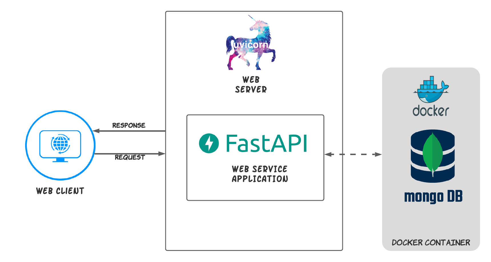

# Permutation Similarity Web Service

FastAPI web service application exposing the following endpoints:

1. <b>/api/v1/similar?word={word}</b><br>
For find similar words from dictionary file based on the permutation similarity

2. <b>/api/v1/stats</b><br>
Stats analytical data for the successful similar requests

3. <b>/docs</b><br>
FastAPI web service application documentation 

## Description

### Architecture

The following diagram represents the current architecture which this solution is designed one


<br>

### Business Logic

The main logical concept which the [Permutation Similarity FastAPI Webservice Application](https://fastapi.tiangolo.com/) 
is based on will be described as follows:
  
1. Processing the dictionary file data by trim every file's line and sorted lexicographically (word document is 
represented by word(the original expression) and permutation_similarity_index(lexicographically sorted notation of word))
2. Each word and his sorted notation is stored as a document in the database(MongoDB) - this way of storing the data make
sure for potential distribute the documents(words) across multiple shards/nodes
3. To find all the similar words to some word w1:
    1. Get the lexicographically sorted notation of w1
    2. Query on the database side after all identical permutation_similarity_index value (because words collection is been
   indexed on the permutation_similarity_index field, then the overall run time to resolve the results is b-tree -> O(log(n))
4. For every successfully similar request, all the relevant analytical data is been stored in the database on the form of document (have the potential
to create more analytical insights)

## Requirements

- Python 3.10
- Docker 4.0+

## Usage

The application suggest an **CLI interface** for interact on the available various functionalities

### Config

For using custom config dir, set the path with the XDG_CONFIG_HOME environment variable
```bash
$ bash export XDG_CONFIG_HOME={CONFIG_PATH}
```

### Init

Run the following bash script for install all the Python requirements and to initilize the database (indexing and storing the dictinary data):
```bash
$ bash init.sh
```

### Run Server

To run the web service application, execute the following command:
```bash
$ python run.py runserver
```

### CLI Application

To interact directly with the CLI, you can execute the following available commands:
```bash
$ python run.py --help
Usage: run.py [OPTIONS] COMMAND [ARGS]...

Options:
  --install-completion [bash|zsh|fish|powershell|pwsh]
                                  Install completion for the specified shell.
  --show-completion [bash|zsh|fish|powershell|pwsh]
                                  Show completion for the specified shell, to
                                  copy it or customize the installation.
  --help                          Show this message and exit.

Commands:
  create-db-collections         Create and indexes the necessary...
  process-data-from-file-to-db  Process and store the dictionary data...
  runserver                     Run the webserver(uvicorn) with the...
```

### Tests

To run the application tests(only CI tests are available), execute the following commands:
```bash
$ pip install -r requirements_dev.txt
```
```bash
$ pytest tests
```

